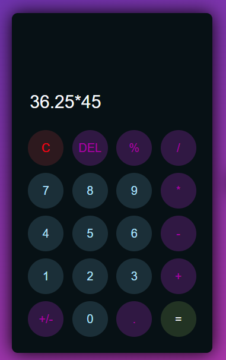
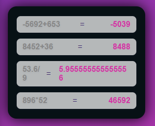

# CalciCo

A modern, responsive calculator web app built with HTML, CSS, and JavaScript. Features include:
- Keyboard support for input
- Calculation history panel
- Responsive design for all devices
- Stylish UI with glassmorphism and vibrant colors

## Screenshots

### Calculator (Dark Mode)

### History Panel

## Features
- Basic arithmetic operations (+, -, ×, ÷)
- Percentage and negate functions
- Calculation history (last 10 results)
- Keyboard shortcuts (numbers, operators, Enter, Backspace, %, C)

## Getting Started
1. Clone or download this repository.
2. Open `index.html` in your browser.

## File Structure
- `index.html` — Main HTML structure
- `style.css` — All styles for calculator and history panel
- `script.js` — Calculator logic and interactivity

## Usage
- Click buttons or use your keyboard to enter calculations.
- View your last 10 calculations in the history panel.

## Customization
- Edit `style.css` for colors, layout, and effects.
- Extend `script.js` for more functions (scientific, memory, etc).

## License
MIT
